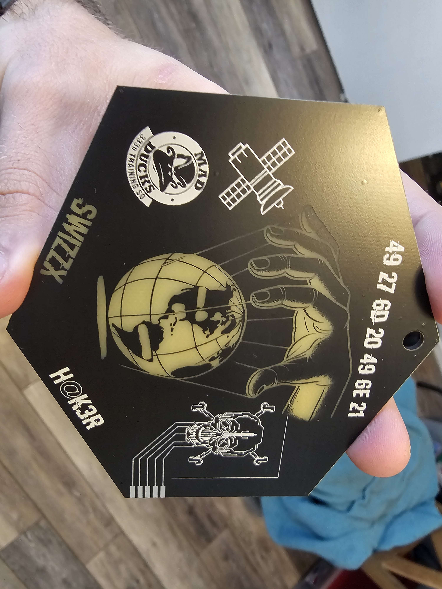

# PCBArt

Some artwork focused Printed Circuit boards (PCB) I have created over time. Some have functional properties (integrated circuits, actual components etc.) and others are purely copper and mask for visuals. Defining "PCBART" as any PCB that tries to showcase the circuit board itself for aesthetic value.

I provide any extra details, schematics, etc. in each of the folders per PCB project. 

## Methodology & Tools

### Tools
* Inkscape - primary SVG/ graphics tool
* KiCAD - primary PCB tool
* JLCPCB - supplier
* Blender - minor use for 3D elements
* VSCode - Editor w/plugins for atmel/arm/ whatever uC toolchain if using a programmable device

### Methodology

I include details on all projects in each sub folder if interested. I include other resources that can be of assistance in creating PCBArt in the methodology folder (short, medium, long tutorials) on various aspects:
* SVG/ graphics editing
* Circuit design (if more involved/ significant)
* PCB layout/ KiCAD things
* Production (low rate) 
* Snippets/ tips on programming various parts.

## Collection 
### Graduation ornament

