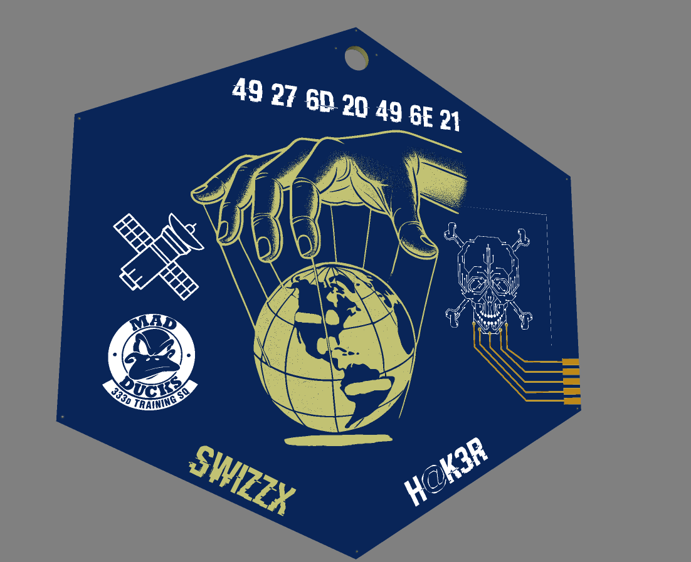
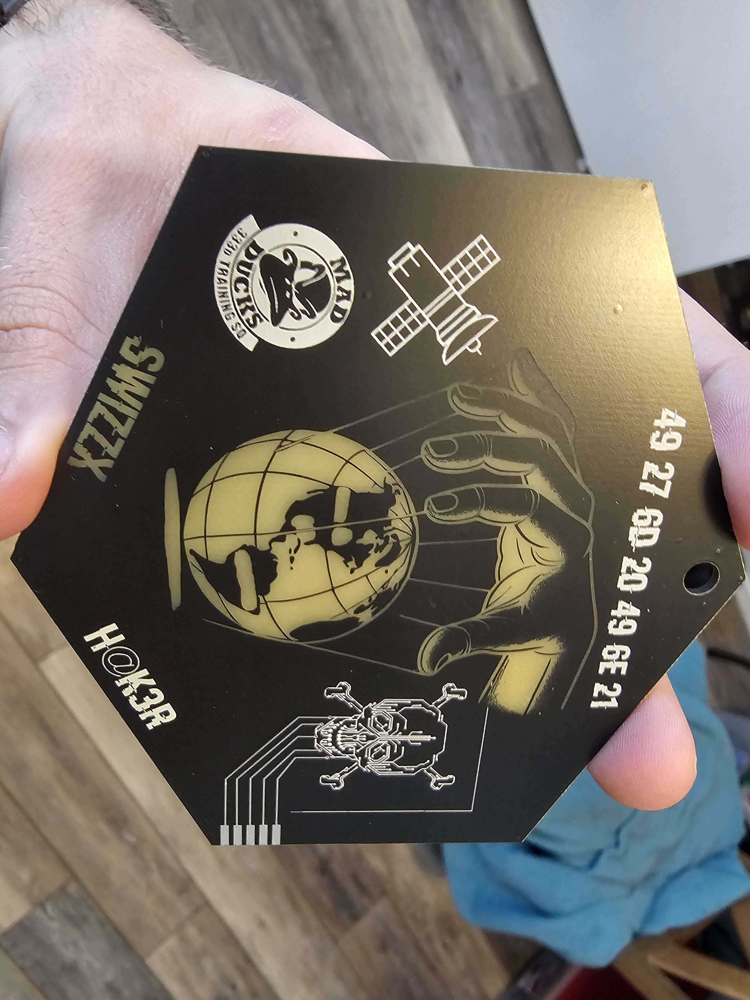
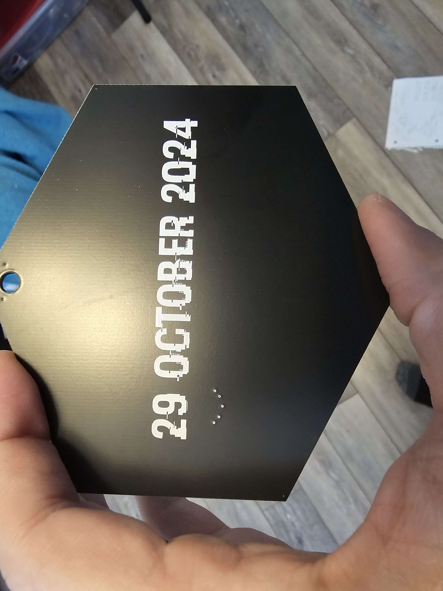

# Graduation PCB ornament

A class graduation themed PCBArt christmas ornament. Only used simple coloring of various silk mask/ solder mask for a "hacker" like theme. Exposed metal makes it look as if it would interface with anything despite only being a 2 layer board with 0 components. 

Cool part about this was utilization of various graphics software (Inkscape) to do the SVG imports onto various layers of the PCB.

### Final Front

### Final back
